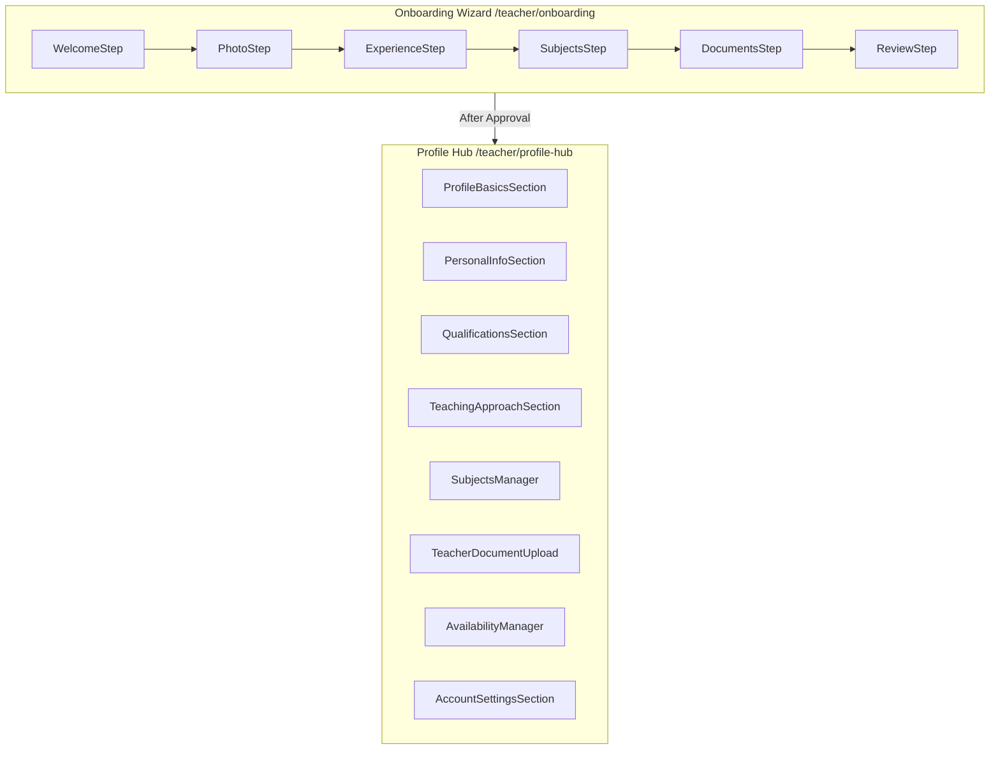

# Onboarding vs Profile Hub Analysis

## What's the Difference?

| Aspect | Onboarding Wizard | Profile Hub |
|--------|-------------------|-------------|
| **Purpose** | One-time initial setup | Ongoing profile management |
| **When Used** | Pre-approval (new teachers) | Post-approval (active teachers) |
| **Flow Type** | Linear wizard (step 1→2→3→4→5→🚀) | Tab-based navigation (jump anywhere) |
| **URL** | `/teacher/onboarding` | `/teacher/profile-hub` |
| **Access Control** | Only DRAFT/CHANGES_REQUESTED | Approved + Changes Requested |

---

## Field Overlap Analysis

| Field | Onboarding | Profile Hub | Duplication? |
|-------|------------|-------------|--------------|
| Profile Photo | ✅ PhotoStep | ✅ ProfileBasicsSection | **YES** |
| Display Name | ✅ PhotoStep | ✅ ProfileBasicsSection | **YES** |
| Full Name | ✅ PhotoStep | ✅ PersonalInfoSection | **YES** |
| Gender | ✅ PhotoStep | ✅ QualificationsSection | **YES** |
| Bio | ✅ ExperienceStep | ✅ ProfileBasicsSection | **YES** |
| Education | ✅ ExperienceStep | ✅ QualificationsSection | **YES** |
| Years Experience | ✅ ExperienceStep | ✅ QualificationsSection | **YES** |
| Subjects/Pricing | ✅ SubjectsStep | ✅ SubjectsManager | **YES** |
| Documents | ✅ DocumentsStep | ✅ TeacherDocumentUpload | **YES** |
| Intro Video | ❌ Missing | ✅ ProfileBasicsSection | Hub only |
| Teaching Style | ❌ Missing | ✅ TeachingApproachSection | Hub only |
| Teaching Tags | ❌ Missing | ✅ TeachingApproachSection | Hub only |
| WhatsApp | ❌ Missing | ✅ PersonalInfoSection | Hub only |
| City/Country | ❌ Missing | ✅ PersonalInfoSection | Hub only |
| Date of Birth | ❌ Missing | ✅ PersonalInfoSection | Hub only |
| Availability | ❌ Missing | ✅ Links to /availability | Hub only |
| Bank Info | ❌ Missing | ✅ Wallet page | Hub only |

---

## Current Architecture



---

## 🎯 Recommendation: **KEEP BOTH, REFACTOR SHARED COMPONENTS**

### Why NOT Merge?
1. **Different UX patterns** - Wizard is linear for first-time, Hub is non-linear for updates
2. **Different content** - Hub has MORE fields (teaching style, availability, bank info)
3. **Different access control** - Onboarding for unapproved, Hub for approved

### Why NOT Eliminate One?
- **Can't eliminate Onboarding:** New teachers need guided first-time setup
- **Can't eliminate Profile Hub:** Approved teachers need to update profiles anytime

---

## ✅ Recommended Refactoring Strategy

### Step 1: Extract Shared Components
Create reusable form fragments that BOTH systems use:

```
components/teacher/shared/
├── PhotoUploadField.tsx      # Used by PhotoStep + ProfileBasicsSection
├── NameFields.tsx            # Display name + full name
├── BioField.tsx              # Bio textarea with character counter
├── ExperienceFields.tsx      # Education + years
├── SubjectPicker.tsx         # Full subject/curriculum/stage selector
└── DocumentUploader.tsx      # ID + certificates uploader
```

### Step 2: Simplify Onboarding Steps
Each step imports shared components:

```tsx
// PhotoStep.tsx (simplified)
function PhotoStep() {
    return (
        <StepWrapper step={1} title="صورتك الشخصية">
            <PhotoUploadField />
            <NameFields />
            <GenderSelector />
        </StepWrapper>
    );
}
```

### Step 3: Hub Sections Use Same Components
```tsx
// ProfileBasicsSection.tsx (simplified)
function ProfileBasicsSection() {
    return (
        <>
            <PhotoUploadField />
            <NameFields displayOnly />
            <BioField />
            <IntroVideoField />  {/* Hub-only */}
        </>
    );
}
```

---

## Implementation Priority

| Priority | Task | Effort |
|----------|------|--------|
| P1 | Extract PhotoUploadField | 2h |
| P1 | Extract SubjectPicker | 4h |
| P2 | Extract DocumentUploader | 2h |
| P2 | Extract NameFields | 1h |
| P2 | Extract BioField | 1h |
| P3 | Add missing Onboarding fields | 3h |

---

## Summary

**Keep both Onboarding and Profile Hub** but:

1. ✅ Extract 6 shared form components
2. ✅ Onboarding wizard uses shared components
3. ✅ Profile Hub sections use same shared components
4. ✅ Add missing fields to Onboarding (intro video, teaching style)
5. ✅ Single source of truth for form logic/validation

This eliminates code duplication while preserving the distinct UX patterns appropriate for each context.
