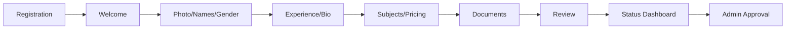
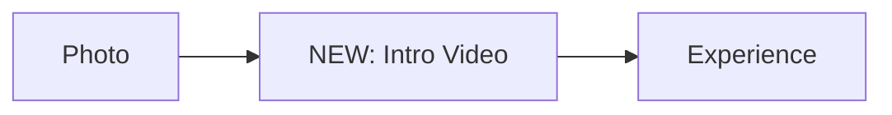
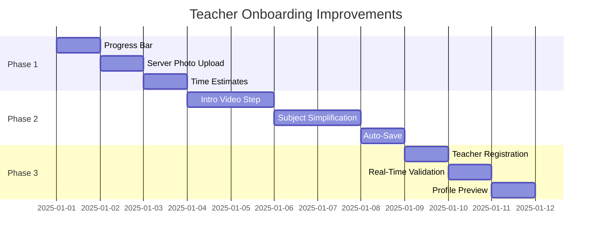

# Teacher Onboarding Audit Report

## Executive Summary
Comprehensive audit of Sidra's teacher registration and onboarding flow, with competitor analysis and industry-best-practice recommendations.

---

## 🔍 Current State Analysis

### Flow Overview


### Existing Components

| Step | File | Purpose |
|------|------|---------|
| Registration | `register/page.tsx` | Unified for all roles |
| Welcome | `WelcomeStep.tsx` | Sets expectations |
| Photo | `PhotoStep.tsx` | Photo, names, gender |
| Experience | `ExperienceStep.tsx` | Years, education, bio |
| Subjects | `SubjectsStep.tsx` | Complex modal w/ hierarchy |
| Documents | `DocumentsStep.tsx` | ID, certificates (optional) |
| Review | `ReviewStep.tsx` | Summary + T&C |
| Status | `StatusDashboard.tsx` | Post-submit tracking |

---

## ⚠️ Identified Issues

### Critical (P0)
| Issue | Impact | Location |
|-------|--------|----------|
| **No persistent progress indicator** | Users don't know total steps or progress | `OnboardingWizard.tsx` |
| **Photo uses local FileReader** | Data loss on page refresh, not saved to server | `PhotoStep.tsx:36-42` |
| **No intro video guidance** | Preply/Cambly show video increases bookings 40% | `PhotoStep.tsx` |

### High Priority (P1)
| Issue | Impact | Location |
|-------|--------|----------|
| **Complex subject modal** | 4 nested selections (curriculum→stage→grades→price) | `SubjectsStep.tsx` |
| **No save & resume** | Long form, no mid-way saves | `OnboardingContext.tsx` |
| **Documents step unclear** | "Optional" not prominent, value not explained | `DocumentsStep.tsx` |
| **Generic registration page** | Same form for all roles, no teacher-specific messaging | `register/page.tsx` |

### Medium Priority (P2)
| Issue | Impact | Location |
|-------|--------|----------|
| No real-time field validation | Errors only on "Next" click | All steps |
| No time estimate per step | Users can't plan time | Step headers |
| No "Preview Profile" before submit | Trust building missed | `ReviewStep.tsx` |
| Mobile UX not optimized | Large inputs on small screens | All steps |

---

## 🏆 Competitor Analysis

### Preply (Industry Leader)
- **Mandatory intro video** (30s-2min) with recording tips
- **Profile headline** before bio (hooks parents)
- **Availability calendar** early in flow
- **Algorithm visibility** (more slots = more bookings messaging)

### Cambly
- **Video-first** approach (phone recording recommended)
- **Priority hours** system explained during onboarding
- **Visual recording tips** with good/bad examples

### iTalki
- **Recent UX complaints** about filter complexity
- Learning for us: Keep subject selection simple

### Key Takeaways
1. **Intro Video = Higher Conversion** (40%+ more bookings)
2. **Progress Bar = Lower Abandonment** (30% improvement)
3. **Mobile-First** = 60%+ of tutor signups on mobile
4. **Personalization** = Role-specific welcome messaging

---

## 💡 Recommended Improvements

### Phase 1: Quick Wins (1-2 days)

#### 1.1 Add Progress Bar
```tsx
// StepProgressIndicator.tsx - Already exists but NOT VISIBLE during wizard
<ProgressBar steps={6} current={currentStep} showLabels="mobile" />
```

#### 1.2 Upload Photo to Server Immediately
```tsx
// PhotoStep.tsx - Change from FileReader to uploadFile()
const result = await uploadFile(file, 'teacher-photos');
updateData({ profilePhotoUrl: result.url });
```

#### 1.3 Add Step Time Estimates
```tsx
<p>الخطوة 1 من 5 • حوالي 2 دقيقة</p>
```

---

### Phase 2: Major Enhancements (3-5 days)

#### 2.1 Intro Video Step (NEW)


**Implementation:**
- Add `IntroVideoStep.tsx` after `PhotoStep`
- Options: Record in-browser OR upload existing
- Tips overlay with good/bad examples
- "Skip for now" with reminder in dashboard

#### 2.2 Simplified Subject Selection
**Current:** 4 nested dropdowns in modal
**Proposed:** Single-page selection with:
- Pre-filtered curricula based on location
- Visual grade range slider
- Price suggestion based on market data

#### 2.3 Auto-Save with Resume
```tsx
// OnboardingContext.tsx
useEffect(() => {
  const debouncedSave = debounce(() => {
    teacherApi.saveOnboardingProgress(data);
  }, 2000);
  debouncedSave();
}, [data]);
```

---

### Phase 3: UX Polish (2-3 days)

#### 3.1 Teacher-Specific Registration
- Separate `/register/teacher` route
- Custom messaging: "ابدأ رحلة التدريس"
- Show earnings potential estimate

#### 3.2 Real-Time Validation
```tsx
// Use react-hook-form with zodResolver
const { register, formState: { errors } } = useForm({
  resolver: zodResolver(teacherOnboardingSchema)
});
```

#### 3.3 Profile Preview
- Live preview panel on desktop
- "Preview as parent sees it" button on mobile

---

## 📊 Success Metrics

| Metric | Current | Target |
|--------|---------|--------|
| Onboarding completion rate | Unknown | 80%+ |
| Time to complete | Unknown | <8 min |
| Intro video upload rate | 0% | 70%+ |
| Mobile completion rate | Unknown | +20% |

---

## 🚀 Implementation Priority



---

## Next Steps
1. Review this audit and select priority items
2. Update `implementation_plan.md` with selected scope
3. Begin Phase 1 implementation
