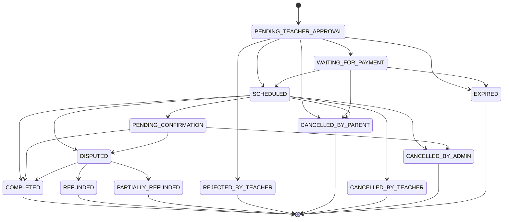

# Booking State Machine

This document describes the Booking lifecycle and allowed status transitions enforced server-side.

## Statuses

- `PENDING_TEACHER_APPROVAL`: booking created, awaiting teacher action.
- `WAITING_FOR_PAYMENT`: teacher approved, awaiting payment/locking funds.
- `SCHEDULED`: paid and scheduled (or demo/package session reserved).
- `PENDING_CONFIRMATION`: teacher marked session complete; dispute window open.
- `DISPUTED`: student/parent raised a dispute.
- Terminal: `COMPLETED`, `REFUNDED`, `PARTIALLY_REFUNDED`, `REJECTED_BY_TEACHER`, `CANCELLED_BY_PARENT`, `CANCELLED_BY_TEACHER`, `CANCELLED_BY_ADMIN`, `EXPIRED`.

## Allowed Transitions

Source of truth: `apps/api/src/booking/booking-policy.constants.ts` (`BOOKING_STATUS_TRANSITIONS`).

## How Transitions Are Enforced

- Validation is centralized in `apps/api/src/booking/booking-status-validator.service.ts`.
- Booking service methods call `bookingStatusValidator.validateTransition(current, next)` before state updates.
- Some transitions are performed with conditional updates (`update`/`updateMany` with `status` in the `where`) to protect against races.

