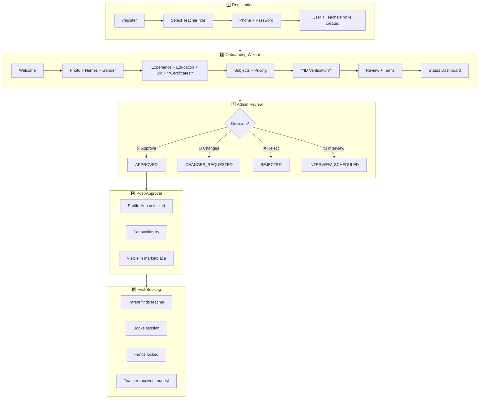
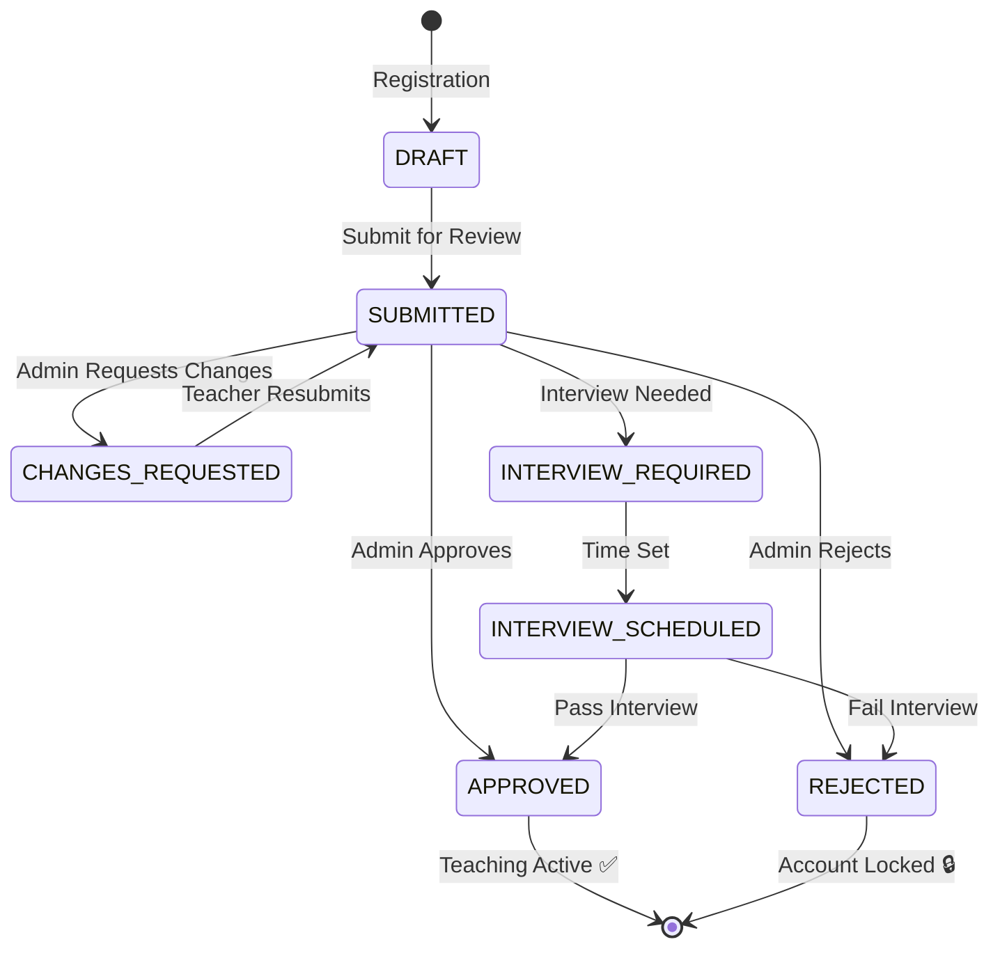

# Teacher Journey: Registration → First Booking

> **Last Updated:** December 2024  
> **Status:** Reflects latest restructuring of Documents/ID sections

---

## Visual Flow Overview



---

## Step-by-Step Details

### 1️⃣ Registration (`/register`)

| Action | What Happens |
|--------|--------------|
| User visits `/register` | Registration form shown |
| Selects "معلم" (Teacher) | Role set to `TEACHER` |
| Enters phone + password | Account created |
| **Backend creates:** | `User` + `TeacherProfile(status: DRAFT)` |
| Redirects to | `/teacher/onboarding` |

---

### 2️⃣ Onboarding Wizard (6 Steps)

| Step | Name | Component | Data Collected |
|------|------|-----------|----------------|
| 0 | مرحباً | `WelcomeStep` | None (introduction, expectations) |
| 1 | الصورة والاسم | `PhotoStep` | `profilePhotoUrl`, `displayName`, `fullName`, `gender` |
| 2 | الخبرة والمؤهلات | `ExperienceStep` | `yearsOfExperience`, `education`, `bio` + **Certificates** |
| 3 | المواد الدراسية | `SubjectsStep` | Subject, curriculum, grades, price per hour |
| 4 | تأكيد الهوية | `DocumentsStep` | `idType`, `idNumber`, `idImageUrl` |
| 5 | المراجعة | `ReviewStep` | Terms acceptance, final review |
| 6 | حالة الطلب | `StatusDashboard` | Shows application status |

#### Step 2: Experience & Qualifications (New Structure)
```
┌─────────────────────────────────────────────┐
│ الخطوة 2: الخبرة والمؤهلات                  │
├─────────────────────────────────────────────┤
│ سنوات الخبرة: [___]                         │
│ المؤهل العلمي: [_______________]            │
│ النبذة التعريفية: [_______________]         │
│                                             │
│ ─────────────────────────────────────────── │
│ 📜 الشهادات والمؤهلات (اختياري)            │
│ [CERTIFICATE] شهادة تدريبية / دورة         │
│ [DEGREE] شهادة جامعية / أكاديمية           │
│ [+ رفع شهادة]                              │
└─────────────────────────────────────────────┘
```

#### Step 4: ID Verification (Restructured)
```
┌─────────────────────────────────────────────┐
│ الخطوة 4: تأكيد الهوية                      │
├─────────────────────────────────────────────┤
│ نوع الهوية: [Dropdown]                      │
│   🆔 البطاقة الوطنية                        │
│   🛂 جواز السفر                             │
│   🚗 رخصة القيادة                           │
│   📋 تصريح إقامة                            │
│                                             │
│ رقم الهوية: [_______________]               │
│                                             │
│ صورة الهوية: [📷 رفع صورة]                  │
│ ✅ تم الرفع                                 │
└─────────────────────────────────────────────┘
```

#### Auto-Save Feature
- Data auto-saves every **2 seconds** as user types
- Uses `teacherApi.updateProfile()` 
- Silent background saves (no UI interruption)

---

### 3️⃣ Submission & Admin Review

#### Submission
```typescript
// When teacher clicks "إرسال للمراجعة"
await teacherApi.submitForReview();
// Status: DRAFT → SUBMITTED
```

**Validation before submit:**
- ✅ Must have `displayName`
- ✅ Must have `bio`
- ✅ Status must be `DRAFT` or `CHANGES_REQUESTED`

#### Admin Review Actions

| Action | New Status | Teacher Experience |
|--------|------------|-------------------|
| ✅ Approve | `APPROVED` | Full access unlocked |
| 🔄 Request Changes | `CHANGES_REQUESTED` | Can edit & resubmit |
| ❌ Reject | `REJECTED` | Account locked |
| 📅 Schedule Interview | `INTERVIEW_SCHEDULED` | Waiting for interview |

---

### 4️⃣ Post-Approval Setup

Once `APPROVED`, teacher can:

| Feature | URL | Description |
|---------|-----|-------------|
| Profile Hub | `/teacher/profile-hub` | Full profile management |
| Set Availability | `/teacher/availability` | Weekly schedule |
| Bank Info | `/teacher/wallet` | Payout settings |
| View Stats | `/teacher` | Dashboard |

**Feature Locking** (`TeacherApprovalGuard`):
- Before approval: Read-only profile, locked features
- After approval: Full access to all features

---

### 5️⃣ First Booking

| Step | Actor | Description |
|------|-------|-------------|
| 1 | Parent | Searches marketplace `/teachers` |
| 2 | Parent | Views public profile `/teachers/[slug]` |
| 3 | Parent | Clicks "احجز حصة" |
| 4 | Parent | Selects child, subject, date/time |
| 5 | System | Validates slot availability |
| 6 | System | Calculates price from `TeacherSubject.pricePerHour` |
| 7 | System | Locks funds in parent wallet (escrow) |
| 8 | System | Creates `Booking(status: PENDING_CONFIRMATION)` |
| 9 | Teacher | Receives in-app notification |
| 10 | Teacher | Approves → `status: SCHEDULED` |

---

## Application Status Lifecycle



---

## Database Fields (TeacherProfile)

### Identity & Basic Info
| Field | Type | Description |
|-------|------|-------------|
| `displayName` | String | Public display name |
| `fullName` | String | Legal name |
| `gender` | Enum | MALE / FEMALE |
| `profilePhotoUrl` | String | Profile photo |
| `introVideoUrl` | String | YouTube/Vimeo link |

### ID Verification (New)
| Field | Type | Description |
|-------|------|-------------|
| `idType` | Enum | NATIONAL_ID, PASSPORT, DRIVER_LICENSE, RESIDENT_PERMIT |
| `idNumber` | String | ID document number |
| `idImageUrl` | String | Uploaded ID image |

### Qualifications
| Field | Type | Description |
|-------|------|-------------|
| `yearsOfExperience` | Int | Years teaching |
| `education` | String | Highest qualification |
| `bio` | String | About me (50+ chars) |

### Application
| Field | Type | Description |
|-------|------|-------------|
| `applicationStatus` | Enum | DRAFT → APPROVED |
| `submittedAt` | DateTime | When submitted |
| `reviewedAt` | DateTime | When reviewed |
| `rejectionReason` | String | If rejected |

---

## Related Files

| Component | Path |
|-----------|------|
| Onboarding Context | `components/teacher/onboarding/OnboardingContext.tsx` |
| Photo Step | `components/teacher/onboarding/steps/PhotoStep.tsx` |
| Experience Step | `components/teacher/onboarding/steps/ExperienceStep.tsx` |
| Subjects Step | `components/teacher/onboarding/steps/SubjectsStep.tsx` |
| Documents Step | `components/teacher/onboarding/steps/DocumentsStep.tsx` |
| Review Step | `components/teacher/onboarding/steps/ReviewStep.tsx` |
| ID Verification | `components/teacher/shared/IdVerificationSection.tsx` |
| Certificates | `components/teacher/shared/CertificatesSection.tsx` |
| Profile Hub | `components/teacher/profile-hub/` |
