# Teacher Journey: Registration → First Booking

## Complete Flow Diagram

```mermaid
flowchart TB
    subgraph REG["1️⃣ Registration"]
        R1["/register page"] --> R2["Select 'Teacher' role"]
        R2 --> R3["Enter phone + password"]
        R3 --> R4["authApi.register()"]
        R4 --> R5["Creates User + empty TeacherProfile"]
    end

    subgraph ONB["2️⃣ Onboarding Wizard"]
        O1["Welcome Step (5 min estimate)"]
        O2["Photo + Names + Gender"]
        O3["Experience + Bio"]
        O4["Subjects + Pricing"]
        O5["Documents (optional)"]
        O6["Review + Terms"]
        O1 --> O2 --> O3 --> O4 --> O5 --> O6
    end

    subgraph SUB["3️⃣ Submission"]
        S1["teacherApi.submitForReview()"]
        S2["Status: DRAFT → SUBMITTED"]
        S3["Status Dashboard shown"]
        O6 --> S1 --> S2 --> S3
    end

    subgraph ADM["4️⃣ Admin Review"]
        A1["Admin views pending applications"]
        A2{Decision?}
        A3["APPROVED ✅"]
        A4["CHANGES_REQUESTED 🔄"]
        A5["REJECTED ❌"]
        A6["INTERVIEW_REQUIRED 📅"]
        S3 --> A1 --> A2
        A2 -->|Approve| A3
        A2 -->|Request Changes| A4
        A2 -->|Reject| A5
        A2 -->|Interview| A6
        A4 -->|Teacher Edits| O2
    end

    subgraph POST["5️⃣ Post-Approval Setup"]
        P1["Profile Hub unlocked"]
        P2["Set weekly availability"]
        P3["Profile visible in marketplace"]
        A3 --> P1 --> P2 --> P3
    end

    subgraph BOOK["6️⃣ First Booking"]
        B1["Parent/Student finds teacher"]
        B2["Views public profile"]
        B3["Selects time slot"]
        B4["CreateBookingDTO sent"]
        B5["BookingService validates"]
        B6["Funds locked in escrow"]
        B7["Teacher gets notification"]
        P3 --> B1 --> B2 --> B3 --> B4 --> B5 --> B6 --> B7
    end

    REG --> ONB
```



---

## Step-by-Step Breakdown

### 1️⃣ Registration
| Step | URL | Component | API |
|------|-----|-----------|-----|
| Visit register | `/register` | `RegisterPage` | - |
| Select Teacher | - | Radio button | - |
| Submit form | - | - | `POST /auth/register` |
| Account created | - | - | Creates `User` + `TeacherProfile(DRAFT)` |
| Redirect | `/teacher/onboarding` | - | - |

### 2️⃣ Onboarding (7 Steps)
| Step | Component | Data Collected |
|------|-----------|----------------|
| 0 | `WelcomeStep` | None (intro) |
| 1 | `PhotoStep` | Photo, displayName, fullName, gender |
| 2 | `ExperienceStep` | yearsOfExperience, education, bio |
| 3 | `SubjectsStep` | Subject + curriculum + grades + price |
| 4 | `DocumentsStep` | ID, certificates (optional) |
| 5 | `ReviewStep` | Terms agreement |
| 6 | `StatusDashboard` | Shows current status |

**Auto-save:** Data saves every 2 seconds via `teacherApi.updateProfile()`

### 3️⃣ Submission
```typescript
// OnboardingContext.tsx
await teacherApi.submitForReview();
// Backend: applicationStatus = 'SUBMITTED'
```

**Validation before submit:**
- ✅ Must have displayName
- ✅ Must have bio
- ✅ Status must be DRAFT or CHANGES_REQUESTED

### 4️⃣ Admin Review
| Admin Action | Resulting Status | Teacher Experience |
|--------------|------------------|-------------------|
| Approve | `APPROVED` | Profile Hub unlocked, visible in marketplace |
| Request Changes | `CHANGES_REQUESTED` | Can edit + resubmit |
| Reject | `REJECTED` | Account locked |
| Schedule Interview | `INTERVIEW_SCHEDULED` | Awaiting interview |

### 5️⃣ Post-Approval
Once `APPROVED`, teacher can:
- Access full Profile Hub
- Set weekly availability (`/teacher/availability`)
- Add bank info for payouts (`/teacher/wallet`)
- Appear in public search results

**Feature Locking:** `TeacherApprovalGuard` blocks:
- Sessions page
- Wallet operations
- Availability settings

### 6️⃣ First Booking
| Step | Actor | What Happens |
|------|-------|--------------|
| 1 | Parent | Searches marketplace, finds teacher |
| 2 | Parent | Views `/teachers/[slug]` public profile |
| 3 | Parent | Clicks "Book Session" |
| 4 | Parent | Selects child, subject, date/time |
| 5 | System | Validates slot availability |
| 6 | System | Calculates price from TeacherSubject |
| 7 | System | Locks funds in parent's wallet (escrow) |
| 8 | System | Creates Booking with status `PENDING_CONFIRMATION` |
| 9 | Teacher | Receives notification |
| 10 | Teacher | Approves → status = `SCHEDULED` |

---

## Application Status Lifecycle


