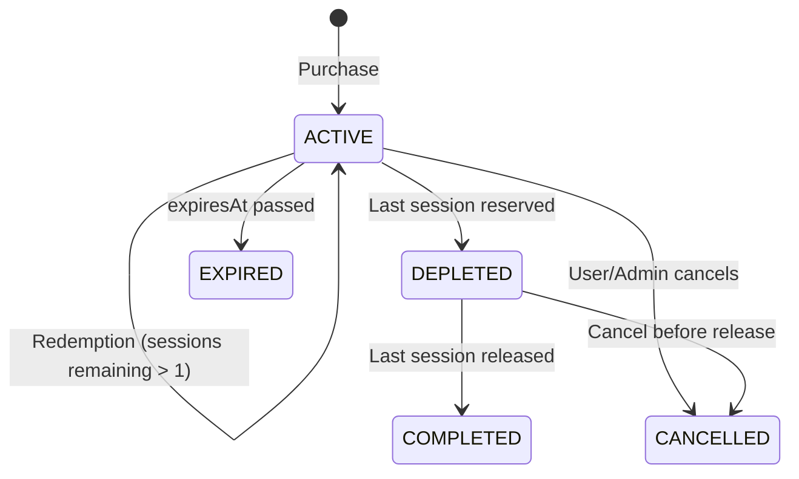

# Package Booking Lifecycle Audit - Updated

## Package State Machine



**States:**
- `ACTIVE`: Has remaining sessions
- `DEPLETED`: All sessions reserved, awaiting completion
- `COMPLETED`: All sessions released
- `EXPIRED` / `CANCELLED`: Terminal states

---

## P0 Fixes Implemented ✅

| ID | Fix | File | Status |
|----|-----|------|--------|
| P0-PKG-1 | Atomic `schedulePackageSession` with conditional update | `package.service.ts` | ✅ |
| P0-PKG-2 | 0-row update throws 409 Conflict | `package.service.ts` | ✅ |
| P0-PKG-3 | `normalizeMoney` on refund | `package.service.ts` | ✅ |
| P0-PKG-4 | Wallet Transaction for purchase | `package.service.ts` | ✅ |

---

## Test Results ✅

```
PASS  test/package.integration.spec.ts (8/8)
  ✓ idempotency: same key returns same booking
  ✓ 409 Conflict on concurrent 0-row update
  ✓ DEPLETED status on last session
  ✓ ownership validation
  ✓ booking price normalized
  ✓ refund amount normalized
  ✓ ledger integers only
  ✓ teacher + platform = total
```

---

## P1 Remaining

- [ ] `restorePackageSession` for cancellation/no-show
- [ ] Define strict restore rules

---

## Closure Criteria

- [x] All P0 fixes implemented
- [x] Schema updated (`DEPLETED`, `PACKAGE_PURCHASE`)
- [x] Integration tests pass (8/8)
- [ ] P1 restore policy (next iteration)
